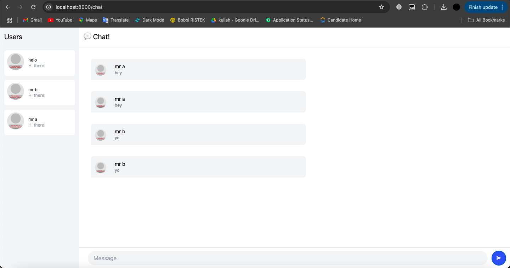
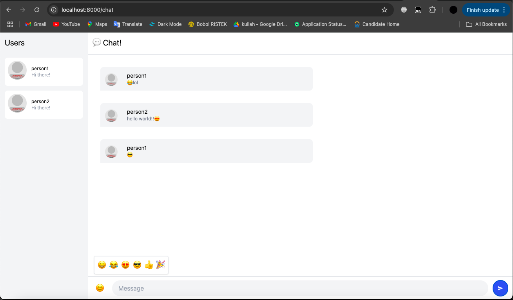

# Reflection 1: Original Code

Ini adalah result dari yewchat ketika dijalankan dengan `npm start`. Disini, saya menggunakan websocket dengan port 2000 karena 8080 sudah taken dan menghasilkan error ketika di run. Source code websocket dapat dilihat melalui tautan `https://github.com/jtordgeman/SimpleWebsocketServer` dan dimodifikasi untuk bisa jalan pada port 2000. Kita dapat login dengan memasukkan nama user yang berbeda, dan chat. Chat message ini akan ke-broadcast ke orang-orang lain yang tergabung.

# Reflection 2: Creative modifier

Modifikasi yang saya lakukan adalah menambahkan emoji picker. Untuk membuatnya, saya memodifikasi chat.rs dengan menambahkan show_emoji_picker pada struct Chat. Kemudian emoji ini di embed pada html yang dikirimkan. Hasilnya adalah pengguna bisa memilih emoji pada kiri message dan mengirimkan di chat. Saat ini masih terbatas ke 6 emoji, namun bisa dikembangkan lebih lanjut nantinya.